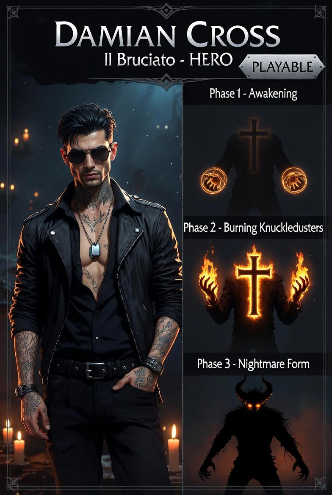

# Damian "Cross" — Cambion (ibrido umano/demone incubo)

---

## Lore

1,88m, 93kg. Buzz cut nero corvino. Occhiali da sole con lenti specchiate, sempre indosso. Giacca di pelle nera oversize, camicia sbottonata nera, pantaloni attillati. Anelli su tutte le dita. Testa inclinata, sorriso beffardo. Voce bassa e ironica.

*"La magia è per chi ha paura di sporcarsi le mani."*

Giocare Damian è scommettere su quanto lontano si vuole spingere, sapendo esattamente qual è il prezzo. E scegliere comunque.

---

## Sistema Vitale — Riserva Demoniaca + Corruzione

Nessuna barra salute. Due indicatori sovrapposti:

**Corruzione (0–100)**
- Sale ogni volta che Damian subisce danno (+0.5 per ogni punto di danno ricevuto)
- Non scende mai da sola
- Ogni soglia superata scala automaticamente la fase se la fase attuale è inferiore
- Soglie: 25 → Fase 1, 55 → Fase 2, 80 → Fase 3

**Riserva (0–100)**
- Parte piena, si consuma stando in Fase 1+
- Drain per fase: Fase 1 = 2/s, Fase 2 = 5/s, Fase 3 = 12/s
- Se si azzera in Fase 3 → stato Traumatico (bypass delle fasi intermedie)
- In stato Traumatico si rigenera lentamente; raggiunto 30 → sblocca di nuovo le fasi

Damian muore solo se subisce danno in stato Traumatico con riserva = 0.

---

## Fasi

| Fase | Trigger | Colore | Effetti |
|---|---|---|---|
| Base | Inizio run | `0x222233` grigio scuro | Attacco normale, pausa tattica disponibile |
| Fase 1 — Risveglio | Corruzione > 25 o F | `0x886600` ambrato | +30% danni, riserva drena 2/s |
| Fase 2 — Demone Minore | Corruzione > 55 o F | `0x440066` viola scuro | Danno ridotto 25%, +20% velocità, shadow attivo |
| Fase 3 — Demone Incubo | Corruzione > 80 o F | `0x880022` rosso scuro | ×5 forza, lifesteal (uccisione = +10 riserva), shadow attacca ogni 2s, pausa tattica disabilitata |
| Berserk | Riserva < 10 in Fase 3 | `0xff0000` rosso pieno | Attacchi deviati ±30°, shadow attacca bersagli casuali |
| Traumatico | Riserva = 0 in Fase 3+ | `0x555566` grigio pallido | Velocità dimezzata, nessuna fase, riserva rigenera lentamente |

**Regole transizione:**
- F scala di una fase se riserva > 20; ignorato in Fase 3 e Berserk
- Non esiste discesa manuale di fase
- Uscita da Fase 3 per riserva esaurita → diretto in Traumatico (senza passare per Berserk se riserva = 0 direttamente)

---

## Controlli

| Tasto | Base | Fase 1 | Fase 2 | Fase 3 | Berserk |
|---|---|---|---|---|---|
| LMB | Pugno 15 dmg | Pugno potenziato 20 dmg | Pugno + push 22 dmg | Pugno devastante 75 dmg | Pugno 75 dmg, direzione ±30° |
| RMB | — | Colpo pesante 30 dmg (cd 1.5s) | Shadow parry — assorbe prossimo colpo (3s) | Shadow lash — proiettile verso cursore 40 dmg | Shadow lash direzione casuale |
| F | Scala fase | Scala fase | Scala fase | Ignorato | Ignorato |
| SPACE | Pausa tattica | Pausa tattica | Pausa tattica | Disabilitata | Disabilitata |

Shadow lash (RMB Fase 3) è l'unica abilità mouse-aimable di Damian.

---

## L'ombra (Fase 2+)

- Rectangle 18×26, colore `0x220033`, alpha 0.5
- **Fase 2:** segue Damian con lag ~120ms (interpolazione posizione)
- **Fase 3:** ogni 2s si stacca, lerp veloce verso nemico più vicino in raggio 80px, infligge 20 dmg, lerp lento di ritorno
- **Berserk:** stesso ma bersaglio casuale

---

## Indicatori visivi

- **Corruzione:** Rectangle 6×6 sopra Damian, colore scala da `0x444444` (0%) a `0xff2200` (100%)
- **Riserva:** Rectangle 6×6 affiancato, colore scala da `0x6600aa` (piena) a `0x110022` (vuota); lampeggia quando < 20%
- **Traumatico:** overlay bianco semi-trasparente che lampeggia lentamente

---

## Note tecniche

- File: `src/characters/Damian.js`, logica fasi: `src/characters/DamianPhase.js`
- Estende `BaseCharacter`
- Stato: **implementato** (tutte le fasi, shadow, indicatori, pausa tattica)
- Visuale placeholder: Rectangle 20×28, colore cambia per fase
- Test: `tests/characters/DamianPhase.test.js` (31 test)
