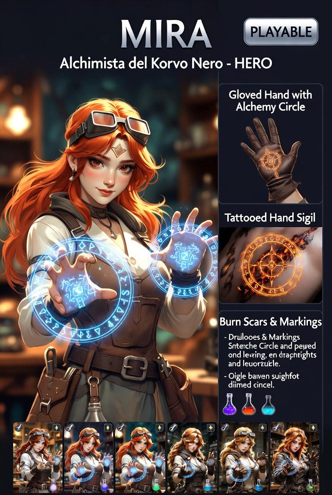

# Mira — Alchimista di Korvo Nero

---

## Lore

20 anni. Umana. Nata nel Quartiere degli Esiliati della Città Libera di Valdris. 1,60m, 50kg. Capelli rosso rame acceso, occhi verde smeraldo. Indossa sempre i goggles, la cintura dell'alchimista carica di fiale, e i guanti alchemici con i cerchi di trasmutazione incisi.

I tatuaggi sulle braccia e sui palmi non sono inchiostro. Sono cicatrici alchemiche — linee conduttrici che contengono tracce di metallo vivo, un circuito permanente che collega il suo nucleo energetico alle mani. Quando esagera, le linee si surriscaldano. Bruciano.

I guanti sono il suo fusibile. Se sbaglia una trasmutazione o accumula troppa energia, si bruciano loro prima delle sue mani. Senza guanti, un errore potrebbe costarle le dita.

*Principio fondante: l'alchimia è la scienza di comprensione, scomposizione e ricomposizione della materia. Non è onnipotente. È impossibile creare qualcosa dal nulla.*

Giocare Mira è giocare con ciò che il piano ti dà. Ogni stanza è un laboratorio. Ogni materiale è una risorsa. Ogni errore ha un prezzo fisico.

---

## Sistema Vitale — Calore Alchemico

Nessuna barra salute. Doppio indicatore visivo:

**Temperatura dei tatuaggi**
- Le linee sulle braccia cambiano colore dal bianco al rosso acceso
- Al massimo bruciano la pelle: penalità visiva e riduzione temporanea della precisione delle trasmutazioni

**Integrità dei guanti**
- I guanti hanno durabilità
- Se si rompono, ogni trasmutazione fallita causa Rebound diretto sul corpo: sanguinamento, perdita temporanea di un senso, svenimento breve

Subire danno fisico riduce la sua capacità di muoversi e concentrarsi, rendendo le trasmutazioni più lente e meno precise.

---

## Abilità — Sintesi Somatica

Batte le mani insieme per attivare la reazione (nessun cerchio necessario grazie ai guanti e ai tatuaggi).

| Abilità | Descrizione |
|---|---|
| **Difesa** | Tocca una superficie → muro istantaneo o cupola di protezione. Richiede materiale sotto i piedi |
| **Attacco terreno** | Trasforma il pavimento sotto i nemici in sabbie mobili o fa emergere lance di pietra/metallo |
| **Riarmo al volo** | Rimodella metallo disponibile (spada rotta, armatura, ringhiera) in lancia o scudo |
| **Reazione Metamorfica** | Non cambia forma, cambia consistenza: pavimento solido → gelatinoso, muro di pietra → fragile come vetro, aria compressa → parete solida temporanea |
| **Pozioni potenziate** | Trasmuta le fiale alla cintura: Acqua → ghiaccio esplosivo, Olio → fiamma accelerata, Acido → vapore corrosivo |

---

## Limiti

- Senza materiale disponibile non può fare nulla — in stanze spoglie è al minimo della potenza
- Deve toccare fisicamente ciò che trasmuta. Mani legate = senza poteri
- Trasmutare esseri viventi o materiali complessi richiede tempo e concentrazione
- Materiali alieni o sconosciuti richiedono analisi prima dell'uso — la prima reazione potrebbe fallire

## Rebound (Contraccolpo)

Se forza la natura oltre i limiti dello scambio equivalente — cerca di creare energia dal nulla o trasmuta qualcosa di valore superiore al materiale disponibile — il contraccolpo colpisce il suo corpo: sanguinamento, svenimento temporaneo, perdita di un senso per qualche secondo.

---

## Tile speciali

| Tile | Effetto su Mira |
|---|---|
| METAL | +risorse per trasmutazioni metalliche |
| Deposito materiali | Trasmutazioni garantite senza rischio Rebound |
| Stanza spoglia | Nessun materiale → solo attacchi fisici base |
| ALTAR | Possibile fonte di materiali arcani |

---

## Sinergia con la mappa

Mira è il personaggio che trae più vantaggio dall'ambiente. Ogni stanza ricca di materiali è un laboratorio a cielo aperto. Le stanze spoglie sono la sua debolezza principale. Distruggere muri (Reazione Metamorfica) può aprire nuovi percorsi o scoprire risorse nascoste.

---

## Note tecniche

- File da creare: `src/characters/Mira.js`
- Estende `BaseCharacter`
- Stato: **design approvato, non ancora implementata**
- Spec di riferimento: `docs/superpowers/specs/2026-05-18-fractured-inheritance-design.md`
- Richiede: sistema materiali per stanza, interazioni tile METAL/depositi
