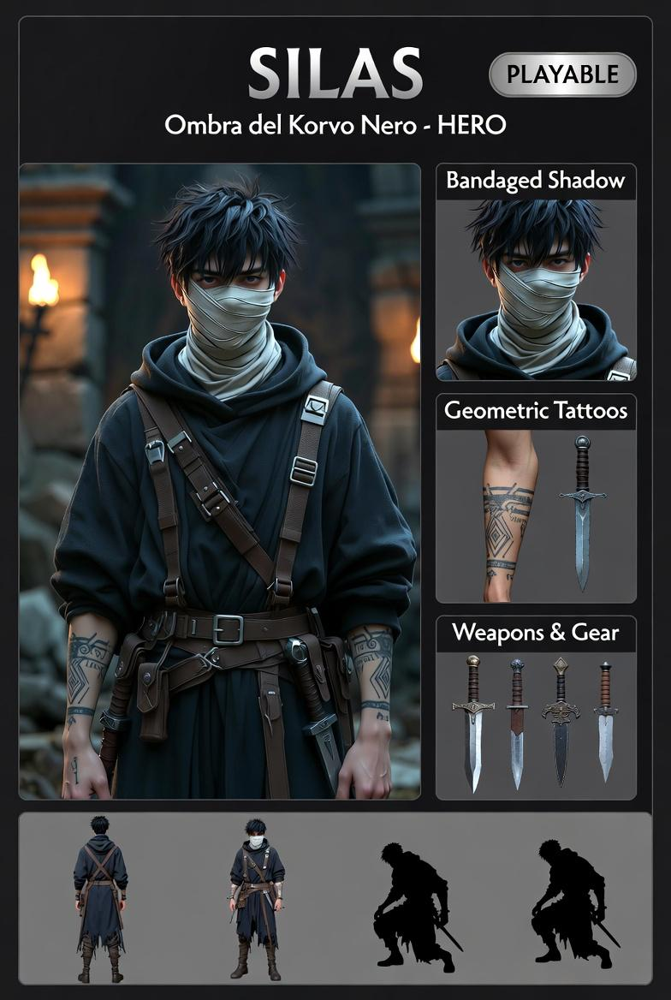

# Silas — Ombra del Korvo Nero

---

## Lore

25 anni. Nordico, nato nelle Lande del Nord, concepito nell'Abisso di Khol. Da parte di madre ha ereditato la vista nel buio. 1,82m, 75kg. Capelli nero carbone, lisci e spesso disordinati. Occhi grigio tempesta, iridi chiarissime quasi bianche. Pelle pallida, quasi esangue. Maschera che copre il viso. Tatuaggi rituali geometrici sugli avambracci. Cintura con tre daghe rituali. Sempre accovacciato o appoggiato ai muri, sempre in penombra. Parla pochissimo, comunica quasi solo a gesti. È inquietante.

Giocare Silas è giocare nell'ombra che gli altri non vedono.

---

## Sistema Vitale — Sangue Congelato

Nessuna barra salute. Silas ha un **indicatore di temperatura del sangue** (0–100, dove 100 = caldo/pieno).

| Evento | Effetto sulla temperatura |
|---|---|
| Colpo ricevuto | −20 |
| Shadow Bind (RMB) | −15 |
| Shadow Teleport (Q) | −25 |
| Shadow Fusion attiva (F) | −5/s |
| In zona d'ombra (passivo) | +8/s |
| Fuori dall'ombra (passivo) | +3/s |

**A temperatura 0 (max gelo):**
- Velocità dimezzata
- Tutti i poteri ombra disabilitati
- Prossimo colpo ricevuto = morte istantanea

Silas non muore per il freddo — muore quando è congelato e viene colpito. La priorità è sempre recuperare temperatura in ombra prima di esporsi.

---

## Zone d'ombra

Le zone d'ombra determinano dove Silas può usare i suoi poteri:

- **Corridoi** (`TILE.CORRIDOR`) — sempre in ombra
- **Perimetro stanze** — tile FLOOR adiacenti ad almeno un WALL (profondità 1 tile dai muri)
- **Patch sparse** — 2–3 patch casuali 1×2 per stanza, posizionate lontano dal centro

**In luce piena** (lontano da muri, lontano da SHADOW tiles): Silas è un combattente ordinario senza abilità speciali. Nessun bonus, nessun potere.

---

## Controlli

| Tasto | In ombra | In luce |
|---|---|---|
| WASD | Movimento + direzione attacchi | Movimento |
| LMB | Pugnalata — 12 dmg base + bonus ombra | Pugnalata — 12 dmg |
| RMB | **Shadow Bind** — immobilizza nemico 2s (−15 temp) | Nessun effetto |
| Q | **Shadow Teleport** — teletrasporto al punto d'ombra più vicino in direzione WASD, max 80px (−25 temp) | Nessun effetto |
| F | **Shadow Fusion** toggle — invisibilità finché in ombra (−5/s temp) | Nessun effetto |
| SPACE | Pausa tattica | Pausa tattica |
| Scroll | Zoom camera | Zoom camera |

Shadow Teleport fallisce se c'è un tile LIGHT tra Silas e la destinazione.

---

## Potenza dell'ombra — Meccaniche offensive

| Condizione | Effetto |
|---|---|
| Primo colpo dopo attivazione Shadow Fusion | **Backstab — 36 dmg (×3)**, Shadow Fusion si consuma |
| Ogni colpo in zona d'ombra (senza Fusion) | **+50% danno — 18 dmg** |
| Shadow Bind + LMB immediato | Nemico immobile: **×2 danno** |
| Shadow Bind + Backstab in combo | Combo massima: **~72–108 dmg** in meno di un secondo |

Il loop ideale: Shadow Fusion in corridoio → avvicinarsi silenzioso → Shadow Bind → Backstab → ritiro in ombra a recuperare temperatura.

---

## Shadow Fusion (F) — Invisibilità

- Attiva solo in zona d'ombra
- Se Silas esce dalla zona d'ombra mentre la Fusion è attiva, diventa visibile ma la Fusion rimane "pronta"
- Rientrando in ombra, torna invisibile
- Il primo attacco consuma la Fusion (Backstab) e azzera l'invisibilità

---

## Shadow Teleport (Q)

- Rileva il tile d'ombra più vicino nella direzione di facing, entro 80px
- Se un tile LIGHT interrompe il percorso, l'abilità fallisce silenziosamente (nessun costo)
- Movimento istantaneo — nessun tween visivo, solo posizione cambiata

---

## Limiti

- In luce piena: combattente mediocre senza poteri
- Non può portare nessuno con sé nel teletrasporto
- Non può creare luce, non può curarsi, non può parare colpi fisici pesanti
- Temperatura = sia risorsa abilità sia salute: usare troppi poteri lo rende fragile
- Il recupero di temperatura è lento fuori dall'ombra: una volta esposto deve ritirarsi presto

---

## Visuale placeholder (Rectangle)

- **Silas:** Rectangle 16×24, colore cambia con la temperatura:
  - Caldo (100): `0x0a0a1a` (blu-nero)
  - Freddo (50): `0x1a4488` (blu ghiaccio)
  - Max gelo (0): `0x4488ff` (azzurro vivo)
- **Shadow Fusion attiva:** alpha pulsa tra 0.3 e 0.7 ogni 400ms
- **Indicatore temperatura:** Rectangle 6×6 sopra Silas, stesso gradiente blu
- **Indicatore ombra:** Rectangle 4×4 laterale, verde scuro `0x003300` se in ombra, `0x111111` se in luce

---

## Note tecniche

- File da creare: `src/characters/Silas.js`, `src/characters/SilasTemp.js` (logica temperatura pura, testabile)
- Estende `BaseCharacter`
- `GameScene` espone `isInShadow(tileX, tileY)` (nuovo metodo)
- `FloorBuilder` aggiunge 2–3 patch SHADOW sparse per stanza
- Stato: **da implementare**
