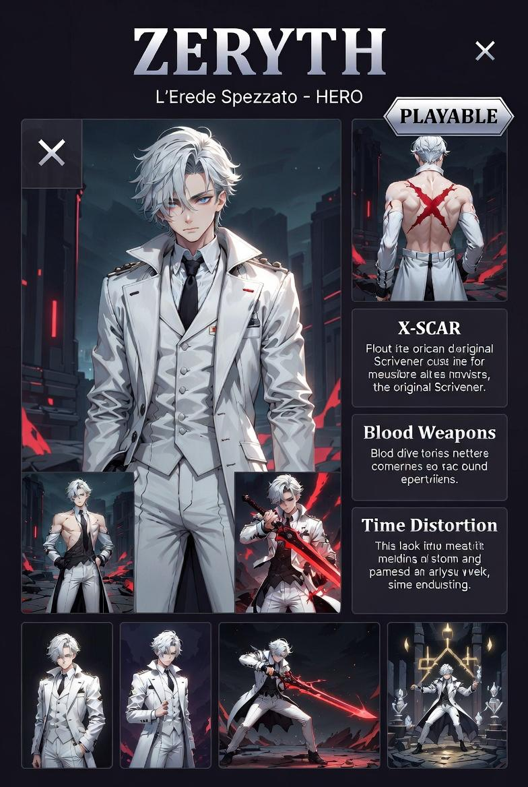

# Zeryth — Erede dei Vettori del Tempo

---

## Lore

Non è nato. È stato creato nelle profondità di Illyrium, attraverso rituali precisi, da una stirpe artificiale concepita per condurre e distorcere flussi temporali e corporei. Ventissei anni apparenti, zero invecchiamento. 1,73m, 69kg. Capelli grigio-bianchi, occhi grigio chiaro con riflessi metallici, iridi leggermente fuori fuoco. Schiena dritta, mani in tasca, sguardo sempre annoiato. Prima di ogni scontro ripiega il cappotto, i guanti, gli strati esterni, con la cura di chi non ha nessuna fretta.

La cicatrice a X sulla schiena è l'unica cosa che non si chiude. Non sa perché. Non ne parla.

Giocare Zeryth è giocare a un tempo diverso da quello del piano. Gli ostacoli non scompaiono, diventano lenti.

---

## Sistema Vitale — Integrità Corporea

Nessuna barra salute. Il danno è leggibile visivamente: sotto soglia critica Zeryth inizia a rallentare. La rigenerazione è passiva e costante, accelerata su tile SHADOW e BLOOD_POOL. Muore quando l'integrità crolla a zero.

---

## Controlli

| Tasto | Azione |
|---|---|
| WASD | Movimento + direzione attacchi |
| LMB (click sinistro) | **Strike fisico** — colpo ravvicinato, rapido, nessun costo |
| RMB (tap) | **Proiettile di sangue** — penetrante in linea retta, costa integrità |
| RMB (hold) | **Spada di sangue** — lama condensata dal sangue, swing ad arco su più nemici, durata proporzionale all'integrità spesa |
| Q | **Distorsione locale** — rallenta un'area per pochi secondi |
| SPACE | **Secondo Fratturato** — pausa tattica (rallenta il mondo, non si ferma) |
| Scroll | Zoom camera |
| TAB | Impostazioni / rimappatura tasti |

---

## Abilità nel dettaglio

### Strike fisico (LMB)
Colpo corpo a corpo in direzione WASD. Reach corto, danno moderato, cooldown minimo. Base di tutto il kit.

### Proiettile di sangue (RMB tap)
Proiettile che attraversa tutti i nemici in linea retta. Costa integrità corporea. Mouse-aimable: direzione determinata dal cursore.

### Spada di sangue (RMB hold)
Hold: il sangue si condensa in una lama. Release: swing ad arco che colpisce più nemici. Più a lungo si tiene premuto, più integrità viene consumata, più la lama è potente. In modalità tattica si può posizionare il fendente prima di rilasciare il tempo.

### Distorsione locale (Q)
Rallenta un'area circolare per pochi secondi. Nemici all'interno si muovono al 30% della velocità. Non costa integrità, ha cooldown.

### Secondo Fratturato / Pausa tattica (SPACE)
Il mondo rallenta drasticamente ma non si ferma. Zeryth si muove a velocità normale. Costa mana corporeo. Esaurito il mana: uscita forzata con debuff temporaneo. Il tempo totale in pausa tattica riduce il moltiplicatore punteggio finale.

---

## Limiti

- Proiettile di sangue e Spada di sangue consumano integrità: usarli troppo accelera la morte
- Pausa tattica ha un budget limitato per run
- In zona LIGHT la rigenerazione è bloccata

---

## Tile speciali

| Tile | Effetto su Zeryth |
|---|---|
| SHADOW | Rigenerazione ×2.5, danno ridotto 25% |
| BLOOD_POOL | Rigenerazione ×4 |
| LIGHT | Rigenerazione bloccata |

---

## Note tecniche

- File: `src/characters/Zeryth.js`
- Estende `BaseCharacter`
- Stato: **implementato** (LMB=strike, RMB=proiettile/spada)
- Visuale placeholder: Rectangle 20×28 blu-viola `0x1a0033`
- Q, R, F: riservati, non ancora mappati
